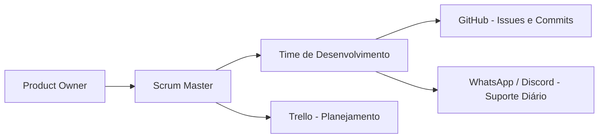

# Especificações do Projeto

Definição do problema e ideia de solução a partir da perspectiva do usuário. É composta pela definição do  diagrama de personas, histórias de usuários, requisitos funcionais e não funcionais além das restrições do projeto.

Apresente uma visão geral do que será abordado nesta parte do documento, enumerando as técnicas e/ou ferramentas utilizadas para realizar a especificações do projeto

## Personas

Perfil 1: João Elias Castrovic

Perfil 2: Mariana Velasco Antunes

Perfil 3: Ricardo Mourani Figueiredo

Perfil 4: Sofia Alencar Takeda

Perfil 5: Lucas Bevenides Monteiro

Perfil 6: Fernanda Alves Oliveira

## Histórias de Usuários

Com base na análise das personas forma identificadas as seguintes histórias de usuários:

|EU COMO... `PERSONA`| QUERO/PRECISO ... `FUNCIONALIDADE` |PARA ... `MOTIVO/VALOR`                 |
|--------------------|------------------------------------|----------------------------------------|
|Usuário do sistema  | Buscar filmes por nome ou gênero  | Encontrar reviews e avaliações         |
|Usuário do sistema  | Avaliar filmes                     | Compartilhar minha opinião com a comunidade |
|Administrador       | Gerenciar as permissões de usuários  | Garantir que cada pessoa tenha acesso apenas ás funcionalidades e informações relevantes ao seu papel |
|Usuário do sistema  | Filtrar filmes por avaliação  | Encontrar opções de bons filmes  |
|Usuário do sistema  | Salvar opções de filmes em uma lista  | Poder assistir em outro dia sem precisar ficar sempre procurando  |
|Usuário do sistema  | Seguir outros usuários  | Ver as avaliações de pessoas que confia e gosta do mesmo gênero de filmes |
|Usuário do sistema  | Ter acesso a lista de filmes mais bem avaliados do momento  | Encontrar mais opções de filmes para assistir |

## Modelagem do Processo de Negócio 

### Análise da Situação Atual

Apresente aqui os problemas existentes que viabilizam sua proposta. Apresente o modelo do sistema como ele funciona hoje. Caso sua proposta seja inovadora e não existam processos claramente definidos, apresente como as tarefas que o seu sistema pretende implementar são executadas atualmente, mesmo que não se utilize tecnologia computacional. 

### Descrição Geral da Proposta

Apresente aqui uma descrição da sua proposta abordando seus limites e suas ligações com as estratégias e objetivos do negócio. Apresente aqui as oportunidades de melhorias.

### Processo 1 – NOME DO PROCESSO

Apresente aqui o nome e as oportunidades de melhorias para o processo 1. Em seguida, apresente o modelo do processo 1, descrito no padrão BPMN. 

### Processo 2 – NOME DO PROCESSO

Apresente aqui o nome e as oportunidades de melhorias para o processo 2. Em seguida, apresente o modelo do processo 2, descrito no padrão BPMN.

## Indicadores de Desempenho

Apresente aqui os principais indicadores de desempenho e algumas metas para o processo. Atenção: as informações necessárias para gerar os indicadores devem estar contempladas no diagrama de classe. Colocar no mínimo 5 indicadores. 

Usar o seguinte modelo: 

Obs.: todas as informações para gerar os indicadores devem estar no diagrama de classe a ser apresentado a posteriori. 

## Requisitos

As tabelas que se seguem apresentam os requisitos funcionais e não funcionais que detalham o escopo do projeto. Para determinar a prioridade de requisitos, aplicar uma técnica de priorização de requisitos e detalhar como a técnica foi aplicada.

### Requisitos Funcionais

|ID    | Descrição do Requisito  | Prioridade |
|------|-----------------------------------------|----|
|RF-001| A aplicação deve permitir que o usuário crie e edite um perfil próprio e único(nome, foto de perfil e biografia).  | ALTA | 
|RF-002| A aplicação deve permitir que o usuário faça o login em seu perfil.   | ALTA |
|RF-003| O perfil do usuário deve conter as avaliações e comentários feitos por ele.   | BAIXA |
|RF-004| A aplicação deve permitir que o usuário busque títulos por nome, gênero e/ou avaliação.   | ALTA |
|RF-005| A aplicação deve permitir que o usuário veja reviews e a avaliação dos títulos dadas pelos outros usuários.   | MÉDIA |
|RF-006| A aplicação deve permitir que o usuário avalie um título com uma nota de 1 a 10.   | ALTA |
|RF-007| A aplicação deve prover ao usuário informações gerais sobre o título (sinopse, duração, classificação indicativa, elenco, média das avaliações).   | BAIXA |
|RF-008| A aplicação deve permitir que o usuário salve títulos em listas personalizadas.   | BAIXA |
|RF-009| A aplicação deve permitir que o usuário faça um comentário sobre um título.   | ALTA |
|RF-010| A aplicação deve prover ao usuário uma lista com recomendações de títulos baseados em sua preferência e histórico.   | BAIXA |
|RF-011| A aplicação deve prover ao usuário uma lista com os títulos mais bem avaliados.   | MÉDIA |
|RF-012| A aplicação deve prover ao usuário uma lista com os lançamento de novos títulos.   | MÉDIA |
|RF-013| A aplicação deve permitir que o usuário siga outros usuários.   | BAIXA |
|RF-014| A aplicação deve prover uma interface administrativa para a moderação do sistema.   | MÉDIA |
|RF-015| A aplicação deve prover um jeito rápido de denunciar material inadequado.   | MÉDIA |
|RF-016| A aplicação deve permitir que o usuário curta e comente o review de outro usuário.   | MÉDIA |

### Requisitos não Funcionais

|ID     | Descrição do Requisito  |Prioridade |
|-------|-------------------------|----|
|RNF-001| A aplicação deve ser responsivo para rodar em um dispositivos móvel | MÉDIA | 
|RNF-002| A aplicação deve processar requisições do usuário em no máximo 3s |  BAIXA | 
|RNF-003| A aplicação deve exigir senha de no mínimo 8 caracteres, com letras maiúsculas, minúsculas, números e caracteres especiais| MÉDIA |
|RNF-004| A aplicação deve permitir criação de resenhas apenas a usuários selecionados | MÉDIA |
|RNF-005| A aplicação deve ter suporte ao sistema operacional Android | MÉDIA |

## Restrições

O projeto está restrito pelos itens apresentados na tabela a seguir.

|ID| Restrição                                             |
|--|-------------------------------------------------------|
|01| O projeto deverá ser entregue até o final do semestre |
|02| Usuário comum não poderá criar resenhas        |
|03| O acesso conteúdo premium será permitido apenas para os uruários assinantes        |
|04| Apenas administradores podem adicionar ou remover conteúdos da plataforma       |
|05| Restringir o acesso a dados sensíveis apenas a administradores       |
|06| Restringir o acesso ao conteúdo premium após o vencimento da assinatura       |

itos funcionais e requisitos não funcionais?](https://analisederequisitos.com.br/requisitos-funcionais-e-requisitos-nao-funcionais-o-que-sao/)

## Diagrama de Casos de Uso

# Matriz de Rastreabilidade

A matriz de rastreabilidade é uma ferramenta usada para facilitar a visualização dos relacionamento entre requisitos e outros artefatos ou objetos, permitindo a rastreabilidade entre os requisitos e os objetivos de negócio. 

A matriz deve contemplar todos os elementos relevantes que fazem parte do sistema, conforme a figura meramente ilustrativa apresentada a seguir.

| ID   |RF-01|RF-02|RF-03|RF-04|RF-05|RF-06|RF-07|RF-08|RF-09|RF-10|RF-11|RF-12|RF-13|RF-14|RF-15|RF-16|RNF-01|RNF-02|RNF-03|RNF-04|RNF-05|
|------|-----|-----|-----|-----|-----|-----|-----|-----|-----|-----|-----|-----|-----|-----|-----|-----|------|------|------|------|------|
|RF-01 |     |     |     |     |     |     |     |     |     |     |     |     |     |     |     |     |      |      |      |      |      |      
|RF-02 |  x  |     |     |     |     |     |     |     |     |     |     |     |     |     |     |     |      |      |      |      |      |      
|RF-03 |  x  |  x  |     |     |     |     |     |     |     |     |     |     |     |     |     |     |      |      |      |      |      |
|RF-04 |     |     |     |     |  x  |     |     |     |     |     |     |     |     |     |     |     |      |      |      |      |      |
|RF-05 |     |     |     |     |     |     |     |     |     |     |     |     |     |     |     |     |      |      |      |      |      |
|RF-06 |     |     |  x  |  x  |     |     |     |     |     |     |     |     |     |     |     |     |      |      |      |      |      |
|RF-07 |     |     |     |  x  |     |  x  |     |     |     |     |     |     |     |     |     |     |      |      |      |      |      |
|RF-08 |     |  x  |     |     |     |     |     |     |     |     |     |     |     |     |     |     |      |      |      |      |      |
|RF-09 |     |  x  |     |  x  |     |     |     |     |     |     |     |     |     |     |     |     |      |      |      |      |      |
|RF-10 |  x  |  x  |     |  x  |     |  x  |     |     |     |     |     |     |     |     |     |     |      |      |      |      |      |
|RF-11 |     |     |     |     |  x  |  x  |     |     |     |     |     |     |     |     |     |     |      |      |      |      |      |
|RF-12 |     |     |     |     |     |     |     |     |     |     |     |     |     |     |     |     |      |      |      |      |      |
|RF-13 |  x  |  x  |     |  x  |     |  x  |     |     |     |     |     |     |     |     |     |     |      |      |      |      |      |
|RF-14 |     |     |     |     |     |     |     |     |     |     |     |     |     |     |     |     |      |      |      |      |      |
|RF-15 |     |     |     |     |     |     |     |     |     |     |     |     |     |  x  |     |     |      |      |      |      |      |
|RF-16 |  x  |  x  |     |     |  x  |     |     |     |     |     |     |     |     |     |     |     |      |      |      |      |      |         
|RNF-01|     |     |     |     |     |     |     |     |     |     |     |     |     |     |     |     |      |      |      |      |      |    
|RNF-02|     |     |     |     |     |     |     |     |     |     |     |     |     |     |     |     |      |      |      |      |      |
|RNF-03|  x  |  x  |     |     |     |     |     |     |     |     |     |     |     |     |     |     |      |      |      |      |      |
|RNF-04|     |  x  |     |     |     |     |     |     |     |     |     |     |     |     |     |     |      |      |      |      |      |
|RNF-05|     |     |     |     |     |     |     |     |     |     |     |     |     |     |     |     |      |      |      |      |      |

# Gerenciamento de Projeto

O gerenciamento eficiente do projeto é fundamental para garantir a entrega dentro dos prazos estabelecidos, com qualidade e alinhado às expectativas dos stakeholders. De acordo com o PMBoK v6, o gerenciamento de projetos é estruturado em dez áreas de conhecimento essenciais: Integração, Escopo, Cronograma (Tempo), Custos, Qualidade, Recursos, Comunicações, Riscos, Aquisições e Partes Interessadas. Essas áreas estão interligadas e devem ser gerenciadas de forma estratégica para garantir o sucesso do projeto.

Para otimizar a execução do NextFlix, utilizaremos o GitHub como ferramenta centralizada de gerenciamento, permitindo o acompanhamento das atividades, versionamento do código e colaboração eficiente entre os membros da equipe. Além disso, empregaremos metodologias ágeis para promover flexibilidade e rápida adaptação às mudanças ao longo do desenvolvimento.

A seguir, detalhamos a distribuição do tempo para cada etapa do projeto.

## Gerenciamento de Tempo

O projeto NextFlix será desenvolvido ao longo de 144 dias, distribuídos em cinco etapas, garantindo uma abordagem estruturada e progressiva para sua implementação.

- **Etapa 1 - Definição e Planejamento `(35 dias)`:**
Durante essa fase inicial, será realizada a definição do projeto, estabelecendo seus objetivos e escopo. Também serão produzidos os documentos de contexto e especificação do problema, garantindo um entendimento claro dos desafios a serem resolvidos.

- **Etapa 2 - Arquitetura e Design `(28 dias)`:**
Aqui, será detalhada a metodologia do projeto, definindo-se as abordagens para o desenvolvimento. A arquitetura da solução será projetada, assegurando uma base sólida para o software. Além disso, será criado o projeto de interface, garantindo que o NextFlix tenha uma navegação intuitiva e agradável. A programação inicial das funcionalidades será iniciada, junto com o planejamento dos testes e a definição dos principais indicadores de desempenho.

- **Etapa 3 - Desenvolvimento e Testes `(35 dias)`:**
Nesta fase, será dada continuidade ao desenvolvimento das funcionalidades principais, garantindo que as implementações sigam os requisitos estabelecidos. Serão criados e executados os planos de testes de funcionalidades e usabilidade, documentando registros de testes para validar a eficácia do sistema e sua aderência aos critérios de qualidade.

- **Etapa 4 - Refinamento e Ajustes `(21 dias)`:**
Com base nos resultados dos testes, serão realizados ajustes e otimizações na programação. Além disso, serão revisados e refinados os planos e registros de testes, garantindo que o NextFlix atenda a altos padrões de qualidade antes da fase final.

- **Etapa 5 - Finalização e Apresentação `(18 dias)`:**
Na última etapa, os ajustes finais serão concluídos, refinando o desempenho, a segurança e a experiência do usuário. O projeto será preparado para a apresentação final, incluindo a produção de um vídeo explicativo e um documento em PDF para detalhar as principais entregas e resultados obtidos ao longo do processo.

O diagrama a seguir apresenta a distribuição do tempo para o desenvolvimento do NextFlix, detalhando as atividades de cada etapa e seus respectivos prazos.

O gráfico de Gantt a seguir apresenta o cronograma detalhado do projeto, incluindo o tempo de desenvolvimento e as atividades correspondentes de cada etapa. Através dele é possível acompanhar o progresso do projeto, garantindo um planejamento eficiente e o cumprimento dos prazos estabelecidos."

## Gerenciamento de Equipe

Para garantir o bom andamento do projeto *NextFlix* , foi adotado um modelo de gestão de equipe baseado em metodologias ágeis, com ênfase no framework Scrum. A organização da equipe considera não apenas a divisão de papéis formais, mas também a colaboração contínua entre os membros, a comunicação transparente e o comprometimento coletivo com os objetivos do projeto.

O gerenciamento da equipe se deu de forma horizontal, prezando pela escuta ativa, apoio mútuo e responsabilidade compartilhada. As decisões foram tomadas de forma participativa, com reuniões semanais, definindo tarefas claras e prioridades através de sprints.

### Tabela de Distribuição de Funções

| Integrante        | Função no Projeto   |
|-------------------|---------------------|
| Artur Maciel      | Scrum Master / Dev  |
| Hana Karolina     | Product Owner / Dev |
| André Dexheimer   | Dev                 |
| Andre Fernandes   | Dev / Design        |
| Eduardo Coutinho  | Dev                 |
| Giovanni Shintaku | Dev / Design        |
| Luiz              | Dev / Design        |

As funções podem sofrer adaptações ao longo do projeto conforme necessidades e imprevistos surgiram.

## Metodologia Adotada

Foi utilizada a **metodologia ágil Scrum**, adaptada à realidade acadêmica e disponibilidade de tempo de cada integrante. Reuniões rápidas ocorrem 1 vezes por semana para acompanhamento das tarefas.

## Fluxo de Comunicação

## Gestão de Orçamento

Gestão de orçamento baseada em valores atuais no mercado brasileiro.

